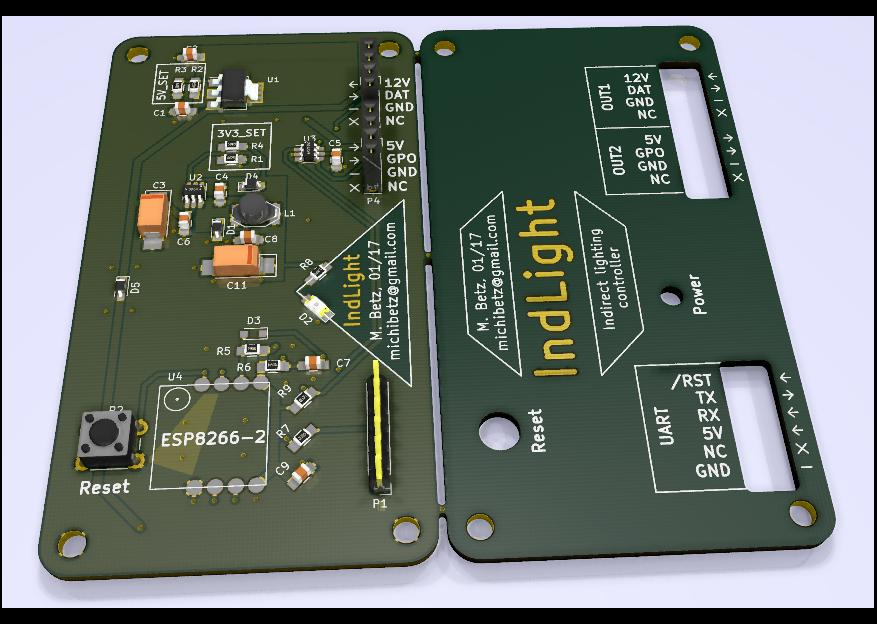

# indLight
Controller for indirect room lighting using 12 V WS2811 LED strips. Based on the ESP8266-2.

Software will be comming soon (with MQTT client).

## Pictures

This is the panelized version which includes a top lid, to be mounted with stand-offs:

